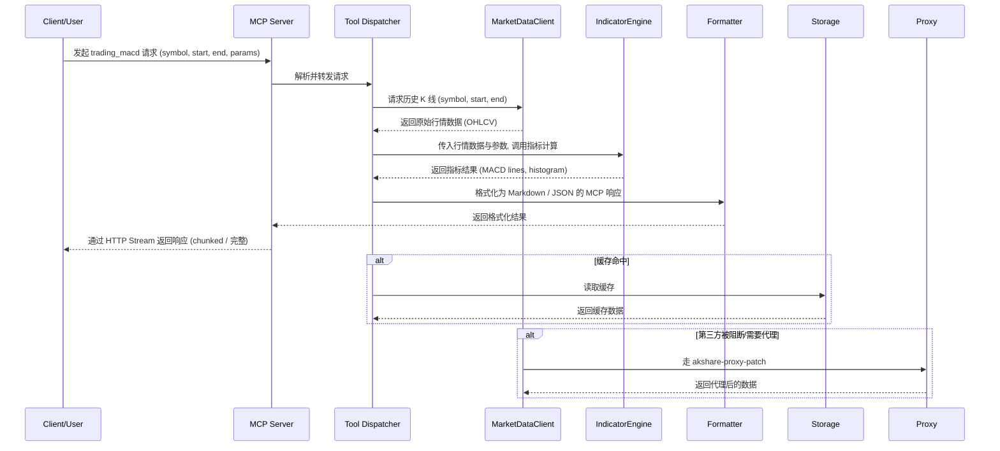

# trading-mcp

交易数据与技术指标的 MCP 服务，基于 `uv` + `pydantic` + `akshare` + `TA-Lib` 构建。

**项目内容**
- 提供股票行情数据查询与基础技术指标计算（K 线、RSI、MA、MACD）。
- 提供中长线基本面数据查询（A 股主要指标、美股三大报表、美股主要指标）。
- 统一的市场数据访问层，支持 A 股与美股（如 `AAPL.US`）。
- MCP 工具化接口，支持 Markdown 或 JSON 输出。

**项目架构**
- `data/`：市场数据接入层。`MarketDataClient` 接口 + `AkshareMarketDataClient` 实现。
- `services/`：业务服务层。将原始行情转换为标准结构，并驱动指标计算。
- `indicators/`：指标引擎封装。基于 TA-Lib 统一调用。
- `models/`：工具请求与响应模型（Pydantic）。
- `utils/`：MCP 输出格式化（表格 Markdown 等）。
- `mcp_app.py` / `main.py`：MCP 服务入口与工具注册。

**目录结构**
- `config/`：配置定义（Pydantic Settings）。
- `data/`：市场数据客户端实现。
- `indicators/`：指标计算引擎。
- `models/`：请求/响应模型。
- `services/`：业务服务层。
- `tests/`：单元测试。
- `utils/`：输出格式化与辅助工具。
- `mcp_app.py`：MCP 工具注册。
- `main.py`：服务启动入口。

**安装与依赖**
1. 安装依赖：

```bash
uv sync --extra dev
```

2. 安装 TA-Lib 系统库：
- macOS: `brew install ta-lib`
- Debian/Ubuntu: `sudo apt-get install libta-lib0 libta-lib0-dev`
- Windows: 使用对应 Python 版本的预编译 wheel

**配置说明**
配置通过环境变量 `TRADING_MCP_` 前缀覆盖：

```bash
export TRADING_MCP_ENVIRONMENT=dev
export TRADING_MCP_DATA_DIR=./data
export TRADING_MCP_DEFAULT_SYMBOL=000001
export TRADING_MCP_HOST=0.0.0.0
export TRADING_MCP_PORT=8000
export TRADING_MCP_AKSHARE_PROXY_ENABLED=true
export TRADING_MCP_AKSHARE_PROXY_AUTH_IP=***
export TRADING_MCP_AKSHARE_PROXY_AUTH_TOKEN=*** TRADING_MCP_AKSHARE_PROXY_RETRY=30
```

字段含义：
- `TRADING_MCP_ENVIRONMENT`：运行环境标识（如 `dev` / `test` / `prod`）。
- `TRADING_MCP_DATA_DIR`：本地数据目录。
- `TRADING_MCP_DEFAULT_SYMBOL`：默认行情标的。
- `TRADING_MCP_HOST`：MCP 服务监听地址。
- `TRADING_MCP_PORT`：MCP 服务端口。
- `TRADING_MCP_AKSHARE_PROXY_ENABLED`：是否启用 `akshare-proxy-patch`。
- `TRADING_MCP_AKSHARE_PROXY_AUTH_IP`：`akshare-proxy-patch` 授权网关 IP；未配置时不会安装 patch。
- `TRADING_MCP_AKSHARE_PROXY_AUTH_TOKEN`：可选授权 token。
- `TRADING_MCP_AKSHARE_PROXY_RETRY`：patch 内部重试次数。

东财反爬代理说明：
- 项目已内置 `akshare-proxy-patch`，会在导入 [data/akshare_client.py](/home/tohsaka/workspace/trading-mcp/data/akshare_client.py) 时自动尝试安装。
- 只有配置了 `TRADING_MCP_AKSHARE_PROXY_AUTH_IP` 且 `TRADING_MCP_AKSHARE_PROXY_ENABLED=true` 时才会启用。
- patch 只会 hook 东财相关域名请求，不影响其他非目标站点。

**Python 用法**

```python
from trading_mcp.config import Settings
from trading_mcp.data import AkshareMarketDataClient
from trading_mcp.indicators import IndicatorEngine

settings = Settings(environment="dev", data_dir="./data", default_symbol="000001")
client = AkshareMarketDataClient()
frame = client.fetch(settings.default_symbol, "2024-01-01", "2024-02-01")

engine = IndicatorEngine()
close_series = frame["close"] if "close" in frame.columns else frame.iloc[:, 0]
result = engine.compute("sma", close_series, timeperiod=5)
print(result.tail())
```

**MCP 服务**
启动 MCP 服务（streamable HTTP）：

```bash
python main.py
```

启动 MCP Inspector（适配 WSL，可从宿主机访问）：

```bash
./dev.sh
```

默认会使用以下 Inspector 配置：
- `MCP_INSPECTOR_HOST=0.0.0.0`
- `MCP_INSPECTOR_CLIENT_PORT=6274`
- `MCP_INSPECTOR_SERVER_PORT=6277`
- `MCP_INSPECTOR_AUTO_OPEN=false`

在 Windows 宿主机浏览器中优先访问：

```text
http://localhost:6274
```

如本机未启用 WSL `localhost` 转发，也可以先在 WSL 内执行 `hostname -I` 查看 IP，再从宿主机访问 `http://<wsl-ip>:6274`。

如果你只想本机 Linux 环境访问，可覆盖为：

```bash
MCP_INSPECTOR_HOST=127.0.0.1 ./dev.sh
```

注意：Inspector 代理具备启动本地进程的能力。`0.0.0.0` 仅应在受信任网络环境中使用。

可用工具：
- `trading_kline(symbol, limit=30, offset=0, period_type="1d", start_date=None, end_date=None, response_format="markdown")`
- `trading_macd(symbol, limit=30, fast_period=12, slow_period=26, signal_period=9, offset=0, period_type="1d", start_date=None, end_date=None, response_format="markdown")`
- `trading_rsi(symbol, limit=30, period=14, offset=0, period_type="1d", start_date=None, end_date=None, response_format="markdown")`
- `trading_ma(symbol, limit=30, period=20, ma_type="sma", offset=0, period_type="1d", start_date=None, end_date=None, response_format="markdown")`
- `trading_volume(symbol, limit=30, offset=0, period_type="1d", start_date=None, end_date=None, response_format="markdown")`
- `trading_fund_flow_individual_em(symbol, limit=30, offset=0, start_date=None, end_date=None, response_format="markdown")`
- `trading_fund_flow_individual_rank_em(indicator="5日", limit=30, offset=0, response_format="markdown")`
- `trading_fund_flow_sector_rank_em(indicator="今日", sector_type="行业资金流", sort_by="主力净流入", limit=30, offset=0, response_format="markdown")`
- `trading_fund_flow_sector_summary_em(symbol, indicator="今日", limit=30, offset=0, response_format="markdown")`
- `trading_fundamental_cn_indicators(symbol, indicator="按报告期", limit=30, offset=0, start_date=None, end_date=None, response_format="markdown")`
- `trading_fundamental_us_report(stock, symbol="资产负债表", indicator="年报", limit=30, offset=0, start_date=None, end_date=None, response_format="markdown")`
- `trading_fundamental_us_indicators(symbol, indicator="年报", limit=30, offset=0, start_date=None, end_date=None, response_format="markdown")`
- `trading_industry_summary_ths(limit=30, offset=0, response_format="markdown")`
- `trading_industry_index_ths(symbol, limit=30, offset=0, start_date=None, end_date=None, response_format="markdown")`
- `trading_industry_name_em(limit=30, offset=0, response_format="markdown")`
- `trading_board_change_em(limit=30, offset=0, response_format="markdown")`
- `trading_industry_spot_em(symbol, limit=30, offset=0, response_format="markdown")`
- `trading_industry_cons_em(symbol, limit=30, offset=0, response_format="markdown")`
- `trading_industry_hist_em(symbol, period="日k", adjust="none", limit=30, offset=0, start_date=None, end_date=None, response_format="markdown")`
- `trading_industry_hist_min_em(symbol, period="5", limit=30, offset=0, response_format="markdown")`
- `trading_info_global_em(limit=30, offset=0, response_format="markdown")`

`trading_fundamental_cn_indicators` 参数说明：
- `indicator` 枚举：`按报告期`、`按单季度`
- `symbol` 兼容输入：`000001`、`000001.SZ`、`600519.SH`（自动补全或规范化后缀）
- 基本面结果按原始行格式返回：`columns + items`

`trading_fundamental_us_report` 参数说明：
- `symbol`（报表类型）枚举：`资产负债表`、`综合损益表`、`现金流量表`
- `indicator`（报表周期）枚举：`年报`、`单季报`、`累计季报`
- `stock` 兼容输入：`TSLA`、`AAPL.US`、`105.AAPL`、`BRK.B`（内部规范化为 AkShare 可识别 ticker）

`trading_fundamental_us_indicators` 参数说明：
- `indicator` 枚举：`年报`、`单季报`、`累计季报`
- `symbol` 兼容输入：`TSLA`、`AAPL.US`、`105.AAPL`、`BRK.B`
- 基本面结果按原始行格式返回：`columns + items`

`trading_volume` 字段说明：
- 返回字段：`timestamp`、`volume`、`amount`、`turnover_rate`
- 单位策略：保留数据源原始单位，并通过响应字段返回单位
  - A 股：`volume_unit=lot`，`amount_unit=CNY`
  - 美股：`volume_unit=share`，`amount_unit=USD`
  - `turnover_rate_unit=percent`
- 当周/月是由日线聚合而来时，`turnover_rate` 可能为 `null`

资金流向工具说明：
- `trading_fund_flow_individual_em`：东方财富个股资金流，`symbol` 支持 `000001`、`600519.SH`、`830799.BJ`
- `trading_fund_flow_individual_rank_em`：东方财富个股资金流排名
  - `indicator` 枚举：`今日`、`3日`、`5日`、`10日`
- `trading_fund_flow_sector_rank_em`：东方财富板块资金流排名
  - `indicator` 枚举：`今日`、`5日`、`10日`
  - `sector_type` 枚举：`行业资金流`、`概念资金流`、`地域资金流`
  - `sort_by` 枚举：`涨跌幅`、`主力净流入`；默认按 `主力净流入` 降序
- 当东方财富排行接口不可用时：
  - 个股排行会回退到同花顺个股资金流排行
  - 行业/概念板块排行会回退到同花顺对应排行
  - 回退后返回列可能不同于东方财富原始列；`地域资金流` 不回退
- `trading_fund_flow_sector_summary_em`：指定板块的成份股资金流
  - 默认使用东方财富，失败时回退到同花顺
  - `symbol` 为板块名称，如 `电源设备`、`风电设备`
  - `indicator` 枚举：`今日`、`5日`、`10日`
  - 回退后返回列可能不同于东方财富原始列
- 资金流向结果统一按原始表格返回：`columns + items`

符号说明：
- A 股示例：`000001`、`300308.SZ`
- 美股示例：`AAPL.US`、`AAPL`、`105.AAPL`、`BRK.B`

行业板块工具说明：
- `trading_industry_summary_ths`：同花顺行业一览表，返回原始板块汇总字段
- `trading_industry_index_ths`：同花顺行业指数，`symbol` 为板块名，支持 `start_date` / `end_date`
- `trading_industry_name_em`：东方财富行业板块名称列表
- `trading_board_change_em`：东方财富当日板块异动详情
- `trading_industry_spot_em`：东方财富行业板块实时行情，`symbol` 为板块名
- `trading_industry_cons_em`：东方财富行业板块成份股，`symbol` 为板块名
- `trading_industry_hist_em`：东方财富行业板块历史行情
  - `period` 枚举：`日k`、`周k`、`月k`
  - `adjust` 枚举：`none`、`qfq`、`hfq`；其中 `none` 表示不复权
- `trading_industry_hist_min_em`：东方财富行业板块分时历史行情
  - `period` 枚举：`1`、`5`、`15`、`30`、`60`
- 行业板块结果统一按原始表格返回：`columns + items`

资讯工具说明：
- `trading_info_global_em`：东方财富全球财经快讯
- 资讯结果统一按原始表格返回：`columns + items`

**响应结构（structuredContent）**

```json
{
  "stock": "TSLA",
  "symbol": "资产负债表",
  "indicator": "年报",
  "columns": ["REPORT_DATE", "ITEM_NAME", "AMOUNT"],
  "items": [],
  "count": 0,
  "total": 0,
  "limit": 30,
  "offset": 0,
  "has_more": false,
  "next_offset": null,
  "start_date": null,
  "end_date": null
}
```

---

## MCP 数据交互流程（架构与时序图）

下面用 Mermaid 绘制当前 MCP 的主要数据交互架构与时序图，帮助理解请求在系统内的流转路径。

### 架构示意（Flowchart）

```mermaid
flowchart LR
  Client[Client / User] -->|HTTP/Stream 请求| MCP[MCP Server]
  MCP -->|调用工具接口| API[Tool Dispatcher / Handlers]
  API --> Market[MarketDataClient (Akshare / Providers)]
  Market -->|行情数据| Storage[Local Cache / Data Dir]
  API --> Indicator[IndicatorEngine (TA-Lib)]
  Indicator -->|指标结果| Formatter[Response Formatter (Markdown / JSON)]
  Formatter -->|返回| Client
  Market -.->|必要时| Proxy[akshare-proxy-patch]
  MCP -->|注册 & 管理| Inspector[MCP Inspector]
```

说明：
- MCP Server：接收外部请求（HTTP/stream），负责解析请求并调用内部工具。
- Tool Dispatcher：把请求路由到具体工具（如 trading_kline、trading_macd）。
- MarketDataClient：统一市场数据接入层，目前以 Akshare 为主实现，支持代理 patch。
- IndicatorEngine：调用 TA-Lib 或内置算法计算技术指标。
- Response Formatter：把结构化数据转换为 Markdown 或 JSON 的 MCP 响应格式。
- Local Cache/Storage：用于短期缓存和历史数据存储以减少 API 调用。

### 时序图（Sequence Diagram）



以上两张图为当前系统的抽象视图；如果你希望把图细化为更多组件（例如：认证、限流、队列、异步任务、监控指标），告诉我需要增加哪些部分，我可以把 Mermaid 图扩展并更新到 README。

---

如果你确认这个更新没问题，我会把改动提交到一个新分支并推送，然后为你创建一个 Pull Request 供 review。
